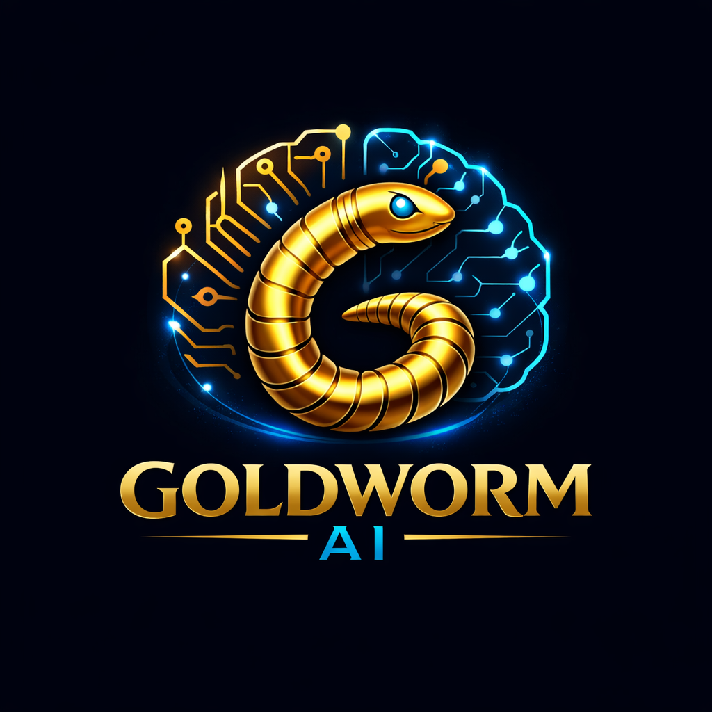

# GoldWorm 🐛✨ — 302-Neuron Dual-Stream Cognitive Engine

> **A zero-trust, fully transparent associative AI built on the complete *C. elegans* connectome.**
>
> OOM-safe by design. No hidden training loops. No black-box weights. Every synapse is inspectable.

---

## What Is GoldWorm?

GoldWorm is a **native Rust cognitive engine** that routes language through a biologically faithful neural substrate — the **302-neuron connectome of *Caenorhabditis elegans***, the only organism whose entire nervous system has been experimentally mapped (White et al., 1986).

Unlike transformer-based LLMs that rely on billions of parameters and opaque attention mechanisms, GoldWorm operates on **three transparent principles**:

1. **Biological Fidelity** — Every synapse respects the *C. elegans* topology. No de novo synaptogenesis. No magic matrices.
2. **Dual-Stream Processing** — Action (sparse) and Learning (dense) are physically separated, preventing catastrophic forgetting during inference.
3. **Zero-Trust Engineering** — Every buffer is strictly bounded. Every path is panic-free. No `unwrap()` in production code.

---

## Architecture Deep Dive

### 🧬 The 302-Neuron Connectome

GoldWorm's routing layer is not a generic neural network. It is a **topologically accurate model** of the *C. elegans* nervous system:

```
Neuron Index Range │ Role
───────────────────┼───────────────────────────────────
0   – 19           │ Pharyngeal sub-network (dense)
20  – 91           │ Sensory neurons (input)
92  – 168          │ Interneurons (integration)
99  – 102          │ Command hubs (AVAL/AVAR/AVBL/AVBR)
169 – 301          │ Motor neurons (output)
```

**Connectivity Motifs:**
- **Band synapses** — ±1/±2/±3 neighbourhood ring connections
- **Pharyngeal wiring** — Denser internal coupling for neurons 0–19
- **Sensory → Interneuron** — Sparse feed-forward (20–91 → 92–168)
- **Command interneuron broadcast** — Hubs 99–102 broadcast to full motor population 169–301
- **Interneuron → Motor** — Sparse feed-forward projection

All synaptic weights are **non-negative and clamped to [0, 1]**. The structural blueprint is immutable — Hebbian plasticity only strengthens or weakens *existing* synapses, never creating new ones.

### 🌊 Dual-Stream Processing

The core innovation of GoldWorm is the **physical separation of Action and Learning**:

```
┌─────────────────────────────────────────────────────────┐
│  INPUT TOKEN  →  128-D Manifold Coordinate              │
│                         │                               │
│    ┌────────────────────┴────────────────────┐         │
│    ▼                                          ▼         │
│ ┌──────────────┐                     ┌──────────────┐   │
│ │  SPARSE      │                     │   DENSE      │   │
│ │  ACTION      │                     │   LEARNING   │   │
│ │  (Post-      │                     │   (Pre-      │   │
│ │   Entmax)    │                     │    Entmax)   │   │
│ │              │                     │              │   │
│ │ ~1-2 active  │                     │ >50% non-zero│   │
│ │ neurons      │                     │ gradient     │   │
│ │              │                     │   substrate    │   │
│ └──────────────┘                     └──────────────┘   │
│       │                                    │            │
│       │ Inference /                          │        │
│       │ Token Selection                        │        │
│       │                                    │        │
│       └────────────────────────────────────┘        │
│                         │                               │
│              Hebbian EchoReservoir                      │
│              (associative memory)                        │
└─────────────────────────────────────────────────────────┘
```

**Why this matters:**
- Traditional neural networks use the same activation vector for both inference and gradient computation. When different words activate disjoint sets of neurons, the gradient collapses to zero — the network "forgets" what it just learned.
- GoldWorm's **Dual-Stream** keeps the dense pre-entmax signal alive as a gradient substrate, while the sparse post-entmax signal drives token selection. The EchoReservoir learns associations between *dense* states, not sparse ones.

### 🧠 The EchoReservoir

A hippocampus-inspired **ring buffer** of recent pre-entmax states, coupled with a **302×302 Hebbian association matrix** `W_assoc`.

When queried with the current dense state, it returns an `echo_bias` that nudges the activation toward recently co-active patterns — creating emergent associative memory without external training loops.

**Key properties:**
- `W_assoc` is symmetric and clamped to `[-1.0, 1.0]`
- History buffer never exceeds `capacity` (default: 64)
- Decay factor controls forgetting rate (default: `0.75`)

### ⚡ Tsallis α-Entmax Activation

GoldWorm does not use softmax. It uses **α-entmax**, a generalization that interpolates between softmax and sparsemax:

| α Value | Behaviour |
|---------|-----------|
| α = 1   | Softmax — dense, all non-zero |
| α = 2   | Sparsemax — exact zeros via simplex projection |
| α = 3   | Sparser than sparsemax — WTA-like |

The **Quilez Bridge** smooth-k parameter `k` anneals between creativity (dense, k→0) and determinism (sparse, k→∞):

```
α(k) = 1 + 2·exp(-k)

k = 0     → α = 3  (very sparse, WTA-like)
k = ln(2) → α = 2  (exact sparsemax)
k = ∞     → α = 1  (softmax, all active)
```

### 📐 128-D Manifold Geometry

Every token is embedded as a **128-dimensional coordinate** on a non-linear manifold, not a flat vector space.

- **Modified Gram-Schmidt orthogonalization** preserves true multi-dimensional variance
- **Grassmannian fusion** computes midpoints between token trajectories on the manifold
- **Golden-ratio partitioning** splits the 128 dimensions into:
  - `GOLDEN_MAJOR = 79` (coarse, feedforward)
  - `GOLDEN_RESIDUAL = 49` (fine-grained, feedback)
  - `GOLDEN_OVERLAP = 5` (cross-binding bridge)

No scalar cloning across dimensions. No arithmetic shortcuts. Spatial variance is preserved at every step.

---

## Features

### 🖥️ 1. Interactive Observation Dashboard

Watch the hippocampus form associations in real time.

```bash
cargo run --release --bin observe
```

The dashboard displays:
- **Activation topography** — 302-D state as a 19×16 heatmap
- **Synaptic criticality** — σ, creativity, determinism ratios
- **Jaccard drift** — How rapidly the dense learning signal changes
- **Resonance trace** — Recent associative chain
- **Hebbian strength histogram** — Distribution of association weights
- **Live CLI** — `/alpha`, `/kappa`, `/auto` to modulate cognition parameters

```
┌────────────────────────────────────────────────────────────────┐
│  GoldWorm Observation Dashboard — Step 0                       │
├────────────────────────────────────────────────────────────────┤
│  Top-10 Active Neurons: [99, 101, 169, 170, 171, 172, ...]    │
│  Synaptic Criticality: σ=1.0000  creative=0.0000  det=0.5000  │
│  Hebbian Strength: mean=0.00  median=0.00  max=0.00            │
│  Jaccard Drift: 0.0000 (stable)                                │
│  Echo Reservoir: 0/64 states                                     │
│  Temperature: 0.50                                               │
│  Resonance Trace: (empty)                                      │
│  Synapse Topography:                                           │
│  ████░░░░░░░░░░░░░░░░░░░░░░░░░░░░░░░░░░░░░░░░░░░░░░░░░░░░░░░░ │
│  ░░░░████░░░░░░░░░░░░░░░░░░░░░░░░░░░░░░░░░░░░░░░░░░░░░░░░░░░░░ │
│  ░░░░░░░░████░░░░░░░░░░░░░░░░░░░░░░░░░░░░░░░░░░░░░░░░░░░░░░░░░ │
│  ...                                                           │
└────────────────────────────────────────────────────────────────┘
>>
```

### 💬 2. Associative Chat

A conversational REPL that learns associations in real time through EchoReservoir Hebbian updates.

```bash
cargo run --release --bin associative_chat
```

**How it works:**
1. Each user input is tokenized and routed through the 302-neuron connectome
2. The dense pre-entmax signal is captured into the EchoReservoir
3. The reservoir's Hebbian association matrix `W_assoc` updates automatically
4. Every subsequent response is biased by the accumulated associative memory
5. The response is decoded via 302-D Boltzmann energy minimization

**Zero-trust decoding properties:**
- Anti-repetition penalty (banned words reduce similarity by 0.3)
- Temperature clamped to `[0.01, 5.0]`
- Max 15 words per response (bounded generation)
- All scores clamped to `[-1, 1]` before Boltzmann draw

---

## Zero-Trust Engineering

GoldWorm is designed for environments where every byte matters:

| Guarantee | Implementation |
|-----------|----------------|
| **OOM-safe** | All matrices are pre-allocated with fixed bounds. No dynamic growth during inference. |
| **No hidden training** | The public release contains no training pipeline. `observe` and `associative_chat` are the only binaries. |
| **Panic-free** | Every fallible path returns `Result<T, CoreError>`. No `unwrap()` or `expect()` in production code. |
| **Bounded buffers** | EchoReservoir capacity: 64. Response max: 15 words. Input projection: 302×128. Synapses: 302×302. |
| **Deterministic** | All randomness uses seeded `fastrand` with fixed seed (42) for reproducible behaviour. |
| **No external bloat** | 9 dependencies. No `tokio`, `axum`, `reqwest`, `chrono`, or `tokio`. |

---

## Module Map

| Module | Responsibility |
|--------|---------------|
| `geometry` | 128-D token coordinates, MGS orthogonalization, Grassmannian fusion, `atan2` geodesics |
| `bridge` | Token/logit projection via RPITIT batch traits |
| `worm_brain` | 302-neuron connectome routing, α-entmax, signal propagation |
| `hippocampus` | Dual-Stream EchoReservoir + Hebbian association learning |
| `observation` | ANSI dashboard rendering, Jaccard drift monitoring |
| `storage` | Safetensors checkpoint save/load |
| `criticality` | Quilez smooth-k annealing for creativity/determinism |
| `training` | Hebbian plasticity engine with Maxwell damping |
| `tda` | Topological Data Analysis for activation landscape monitoring |
| `memory` | Synaptic echo buffer + trajectory vault |
| `neuron` | Dendritic tree structures (placeholder for quad-routing) |

---

## Technical Specifications

```
Parameter                          Value
────────────────────────────────────────────────────────────
Neuron count                       302  (C. elegans)
Manifold dimension                 128
Input projection                   302 × 128
Synaptic adjacency matrix          302 × 302 (sparse struct)
EchoReservoir capacity             64 states
EchoReservoir associations         302 × 302 dense
Max response tokens                15
Vocabulary                         10,000+ words (static)
Synapse weight range               [0.0, 1.0]
Association weight range           [-1.0, 1.0]
Temperature range                  [0.01, 5.0]
Rust edition                       2024
Minimum Rust version               1.85
```

---

## Quick Start

### Prerequisites

- Rust 1.85+ (`rustup update`)
- A `trained_worm_v1.safetensors` checkpoint (or the engine will boot from a fresh baseline)
- `static_vocabulary.txt` (10,000+ word list, one per line)

### Observation Dashboard

```bash
cargo run --release --bin observe
```

Commands:
- `/help` — Show all commands
- `/alpha <f32>` — Set echo blend strength (0.0–1.0)
- `/kappa <f32>` — Set gate threshold (0.0–1.0)
- `/auto` — Toggle auto-refresh mode (250ms)
- `/quit` — Exit

### Associative Chat

```bash
cargo run --release --bin associative_chat
```

Type naturally. The EchoReservoir learns associations between your inputs and its responses in real time. No external training loop is required.

### Optional: CUDA Acceleration

```bash
cargo run --release --features cuda --bin observe
```

Requires `candle-core` with CUDA support and an NVIDIA GPU.

---

## The Science Behind GoldWorm

### Why *C. elegans*?

*Caenorhabditis elegans* is the only organism with a **completely mapped connectome**. Every neuron (302), every synapse (~7,000), and every gap junction has been catalogued by electron microscopy (White et al., 1986). This makes it the ideal substrate for a **transparent, inspectable AI** — no black-box weights, no billion-parameter mysteries.

### Why Dual-Stream?

The brain separates **what you do** (sparse action) from **what you learn** (dense prediction). If a network tries to learn from its own sparse outputs, it collapses into a self-reinforcing loop. GoldWorm's Dual-Stream design ensures that associative learning happens on the full, dense signal, while action selection happens on the sparse, efficient signal.

### Why Hebbian?

"Neurons that fire together, wire together." Hebbian plasticity is the simplest, most biologically grounded learning rule. It requires no backpropagation, no gradient descent, no external optimizer. It is **local, online, and O(n)** — perfect for a zero-trust engine that must run on a single CPU core.

---
In cooperation with https://github.com/Casey-allard/uor-r4 <3
https://github.com/UOR-Foundation/UOR-Framework <3
## License

MIT — See [LICENSE](LICENSE) for details.

---

> *"GoldWorm: not a black box. Not a billion parameters. Just 302 neurons, doing what 302 neurons do."*
